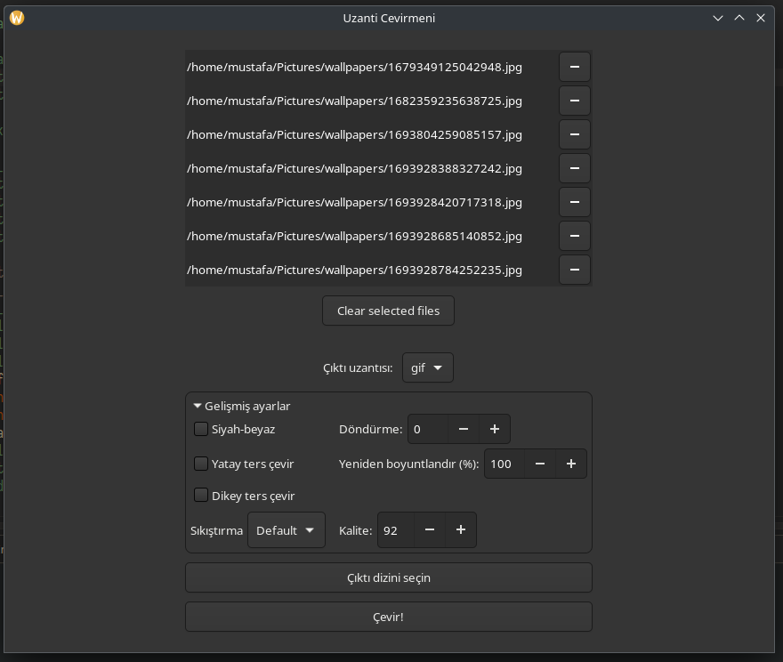

# Uzantı Çevirmeni
Convert every file you want without opening a terminal!

# Used programs
- Pandoc: for converting documents  
- Ffmpeg: for converting video/audio files  
- ImageMagick: for converting image files  
- Libreoffice: replaces pandoc if pandoc is not installed  

